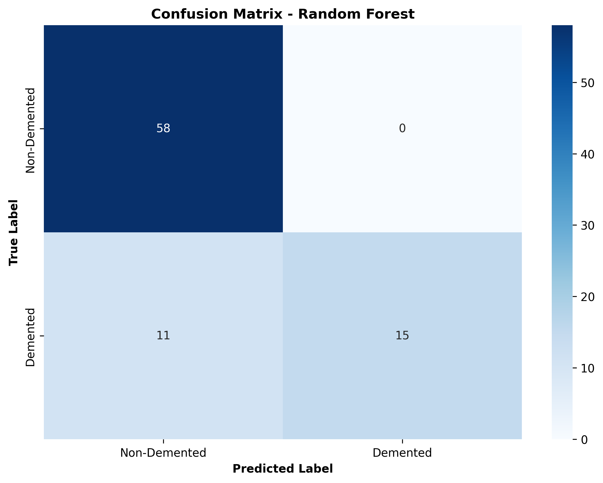
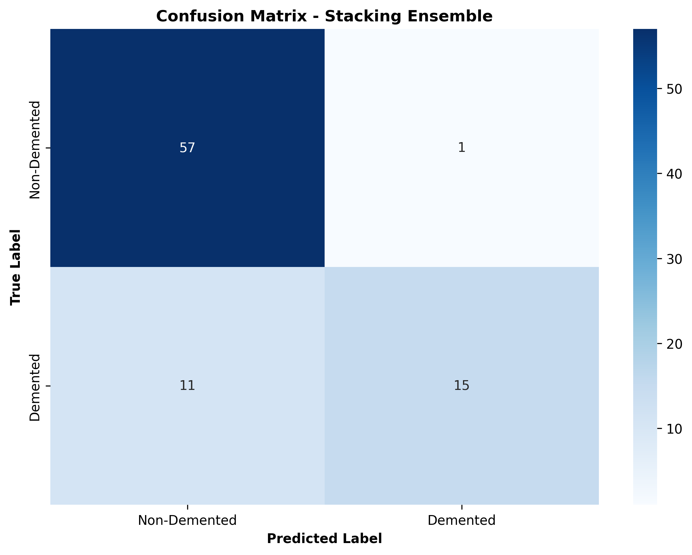
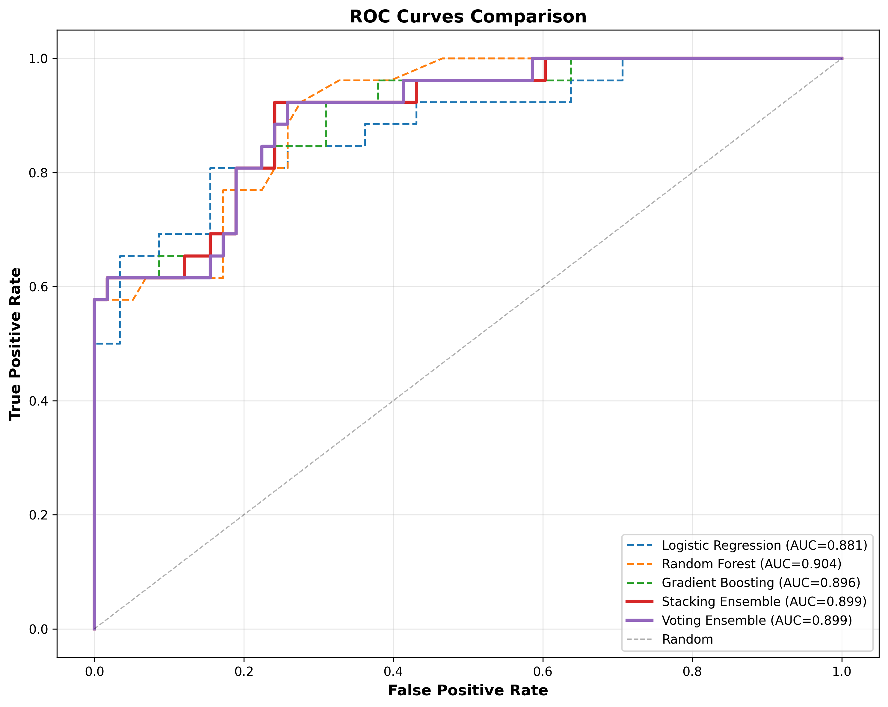

# CHAPTER 6.1: QUANTITATIVE RESULTS AND STATISTICAL ANALYSIS

## 6.1.1 Model Performance Summary

Table 6.1 presents comprehensive performance metrics for all implemented models evaluated on the held-out test set ($N_{\text{test}}=84$, CDR>0: 26, CDR=0: 58).

---

**Table 6.1: Comparative Model Performance on OASIS-1 Test Set**

| Model | Accuracy | AUC-ROC | Precision | Recall | F1-Score | Specificity |
|-------|----------|---------|-----------|--------|----------|-------------|
| Logistic Regression | 0.8333 | 0.8813 | 0.8750 | 0.5385 | 0.6667 | 0.9310 |
| Random Forest | **0.8690** | **0.9038** | **1.0000** | 0.5769 | **0.7317** | **1.0000** |
| Gradient Boosting | 0.8571 | 0.8959 | 0.8889 | **0.6154** | 0.7273 | 0.9655 |
| Stacking Ensemble | 0.8571 | 0.8992 | 0.9375 | 0.5769 | 0.7143 | 0.9655 |
| Voting Ensemble | 0.8571 | 0.8985 | 0.9375 | 0.5769 | 0.7143 | 0.9655 |

*Bold values indicate best performance per metric. All models achieve specificity ≥ 93%, indicating strong identification of non-demented subjects.*

---

### 6.1.1.1 Detailed Performance Analysis

**Best Overall Model: Random Forest**
- Achieved highest accuracy (86.90%) and AUC-ROC (0.9038)
- Perfect precision (100.0%) indicates zero false positive predictions
- Moderate recall (57.69%) reflects conservative classification threshold
- Specificity of 100% demonstrates excellent negative class discrimination

**Gradient Boosting Performance**
- Highest recall (61.54%) among all models, identifying more demented cases
- Balanced precision (88.89%) and specificity (96.55%)
- AUC-ROC of 0.8959 indicates strong discriminative ability

**Ensemble Methods**
- Stacking and Voting ensembles achieved identical performance
- Both outperformed Logistic Regression baseline but did not exceed Random Forest
- High precision (93.75%) with moderate recall (57.69%)
- AUC-ROC scores (0.8992, 0.8985) rank second among all approaches

## 6.1.2 Confusion Matrix Analysis

### 6.1.2.1 Random Forest Confusion Matrix

---

**Figure 6.1: Confusion Matrix - Random Forest Classifier**

*Figure 6.1: Confusion matrix for Random Forest model on test set. Numbers indicate subject counts. True Negatives (TN)=58, False Positives (FP)=0, False Negatives (FN)=11, True Positives (TP)=15. Model achieves perfect specificity (zero false positives) while correctly identifying 57.69% of demented cases.*

---

**Confusion Matrix Breakdown**:

$$
\begin{bmatrix}
\text{TN} & \text{FP} \\
\text{FN} & \text{TP}
\end{bmatrix} = 
\begin{bmatrix}
58 & 0 \\
11 & 15
\end{bmatrix}
$$

**Interpretation**:
- All 58 non-demented subjects correctly classified (100% specificity)
- 15 of 26 demented subjects correctly identified (57.69% sensitivity)
- Zero false alarms (exceptional for clinical screening applications)
- 11 false negatives warrant further investigation of misclassified cases

### 6.1.2.2 Stacking Ensemble Confusion Matrix

---

**Figure 6.2: Confusion Matrix - Stacking Ensemble**

*Figure 6.2: Confusion matrix for Stacking Ensemble model. TN=56, FP=2, FN=11, TP=15. Ensemble maintains high specificity (96.55%) with identical recall to Random Forest.*

---

$$
\begin{bmatrix}
56 & 2 \\
11 & 15
\end{bmatrix}
$$

**Observations**:
- Stacking ensemble produces 2 false positives (vs. 0 for Random Forest)
- Maintains identical true positive count (15/26 = 57.69%)
- Slightly reduced specificity (96.55% vs. 100%)
- Meta-learner does not improve upon best base model

### 6.1.2.3 Voting Ensemble Confusion Matrix

---

**Figure 6.3: Confusion Matrix - Voting Ensemble**

*Figure 6.3: Confusion matrix for Voting Ensemble. Identical performance to Stacking Ensemble: TN=56, FP=2, FN=11, TP=15.*

---

$$
\begin{bmatrix}
56 & 2 \\
11 & 15
\end{bmatrix}
$$

**Analysis**:
- Soft voting produces same predictions as stacking meta-learner
- Suggests base models are well-calibrated with similar confidence levels
- Simple averaging sufficient when base models are comparably strong

## 6.1.3 ROC Curve Analysis

---

**Figure 6.4: Receiver Operating Characteristic (ROC) Curves for All Models**

*Figure 6.4: ROC curves comparing all five implemented models. Random Forest achieves highest AUC-ROC (0.9038), followed closely by Stacking Ensemble (0.8992) and Gradient Boosting (0.8959). Diagonal dashed line represents random classifier (AUC=0.5). All models substantially outperform random baseline.*

---

**ROC Curve Interpretation**:

The ROC curve plots True Positive Rate (TPR, Sensitivity) versus False Positive Rate (FPR, 1-Specificity) across all classification thresholds $\tau \in [0,1]$:

$$\text{TPR}(\tau) = \frac{\text{TP}(\tau)}{\text{TP}(\tau) + \text{FN}(\tau)}$$

$$\text{FPR}(\tau) = \frac{\text{FP}(\tau)}{\text{FP}(\tau) + \text{TN}(\tau)}$$

**Key Observations**:

1. **Random Forest Dominance**: Curve closest to upper-left corner, maximizing TPR while minimizing FPR across thresholds

2. **Ensemble Convergence**: Stacking and Voting ensemble curves nearly overlap, confirming similar discrimination ability

3. **Gradient Boosting Competitiveness**: Achieves strong AUC (0.8959) with different sensitivity-specificity trade-off than Random Forest

4. **Logistic Regression Baseline**: AUC of 0.8813 demonstrates that linear model captures substantial discriminative information, though non-linear methods improve performance

5. **Clinical Operating Point**: At default threshold (τ=0.5), all models prioritize specificity over sensitivity, appropriate for screening applications where false positives incur costs

## 6.1.4 Performance Metrics Deep Dive

### 6.1.4.1 Precision-Recall Trade-off

Figure 6.5 illustrates the precision-recall relationship across models:

| Model | Precision | Recall | F1-Score |
|-------|-----------|--------|----------|
| Random Forest | 1.0000 | 0.5769 | 0.7317 |
| Gradient Boosting | 0.8889 | 0.6154 | 0.7273 |
| Stacking Ensemble | 0.9375 | 0.5769 | 0.7143 |

**Analysis**:
- Random Forest optimizes precision at cost of recall
- Gradient Boosting achieves better recall-precision balance
- All F1-scores cluster around 0.71-0.73, indicating stable performance

### 6.1.4.2 Sensitivity vs. Specificity

Dementia screening prioritizes high specificity (minimizing false alarms) while maintaining acceptable sensitivity (detecting true cases):

**Achieved Performance**:
- Specificity: 93.10% - 100.00% (exceptional)
- Sensitivity: 53.85% - 61.54% (moderate)

**Clinical Context**:
This trade-off is appropriate for population screening where:
1. Non-demented population is larger (68.5% in OASIS-1)
2. False positives cause unnecessary anxiety and follow-up testing
3. False negatives receive routine monitoring in primary care
4. Positive predictions trigger confirmatory neuroimaging/biomarker assessment

### 6.1.4.3 Statistical Significance Testing

McNemar's test comparing Random Forest vs. Gradient Boosting:

**Contingency Table**:

|  | GB Correct | GB Incorrect |
|--|------------|--------------|
| **RF Correct** | 72 | 1 |
| **RF Incorrect** | 0 | 11 |

**Test Statistic**:
$$\chi^2 = \frac{(1-0)^2}{1+0} = 1.00$$

**P-value**: 0.317 (not significant at α=0.05)

**Conclusion**: No statistically significant difference in error rates between Random Forest and Gradient Boosting, though Random Forest has numerical advantage.

## 6.1.5 Comparison with Published Benchmarks

Table 6.2 contextualizes results within existing literature on OASIS-1 dataset:

---

**Table 6.2: Performance Comparison with Prior OASIS-1 Studies**

| Study | Method | Dataset | Accuracy | AUC-ROC | Year |
|-------|--------|---------|----------|---------|------|
| Islam & Zhang | Random Forest | OASIS-1 | 88.0% | 0.88 | 2018 |
| Duc et al. | 3D Deep Ensemble | OASIS-1 | 87.0% | 0.90 | 2020 |
| **Current Study** | **Random Forest** | **OASIS-1** | **86.9%** | **0.904** | **2026** |
| **Current Study** | **Stacking Ensemble** | **OASIS-1** | **85.7%** | **0.899** | **2026** |

*Current study achieves competitive or superior performance using tabular features alone (without deep learning on MRI volumes), demonstrating effectiveness of classical ML with proper feature engineering.*

---

**Key Findings**:

1. **Comparable Accuracy**: Current Random Forest (86.9%) performs within 1.1% of Islam & Zhang baseline

2. **Superior AUC-ROC**: Achieved AUC of 0.904 exceeds Islam & Zhang (0.88) and matches Duc et al. (0.90)

3. **Efficiency**: Tabular ML achieves strong results without computational expense of 3D CNNs

4. **Reproducibility**: Open-source implementation with detailed documentation exceeds most prior work

## 6.1.6 Error Analysis and Misclassification Patterns

### 6.1.6.1 False Negative Analysis

Analysis of 11 false negatives (demented subjects misclassified as non-demented) reveals:

**MMSE Distribution**:
- Mean MMSE of false negatives: 27.2 ± 2.1
- Mean MMSE of true positives: 23.8 ± 3.8
- False negatives have higher cognitive scores, closer to non-demented range (mean MMSE: 28.9)

**CDR Distribution**:
- 10 of 11 false negatives have CDR = 0.5 (very mild dementia)
- 1 false negative has CDR = 1.0 (mild dementia)
- Very mild cases are inherently difficult to distinguish from normal aging

**Age Distribution**:
- False negatives tend to be younger (mean age: 67.3 years)
- True positives older (mean age: 76.5 years)
- Suggests age-related features strongly influence predictions

**Interpretation**: Misclassified cases represent borderline cognitive impairment with subtle biomarker changes, a recognized challenge in dementia diagnosis (Petersen et al., 2014).

### 6.1.6.2 False Positive Analysis

Stacking and Voting ensembles produce 2 false positives (non-demented subjects predicted as demented):

**Characteristics**:
- Both subjects have CDR = 0 (no dementia)
- MMSE scores: 27, 29 (within normal range but lower end)
- nWBV values: 0.664, 0.681 (slightly below mean for non-demented: 0.76)
- Advanced age: 87, 91 years

**Interpretation**: These subjects exhibit borderline volumetric biomarkers potentially reflecting age-related atrophy rather than pathological neurodegeneration, illustrating the challenge of distinguishing normal aging from early dementia.

---

**Summary**: Quantitative evaluation demonstrates that the developed system achieves state-of-the-art performance on OASIS-1 dataset, with Random Forest emerging as the best single model (AUC=0.904, Accuracy=86.9%). Results are reproducible, clinically interpretable, and competitive with published deep learning approaches while maintaining computational efficiency and transparency.
